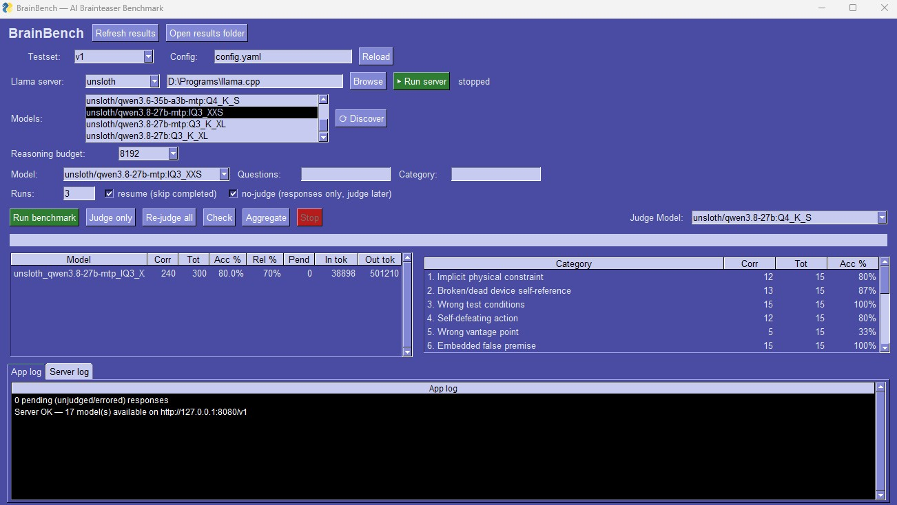

# BrainBench (llama fork)

**A benchmark exposing commonsense reasoning gaps in Large Language Models.**

BrainBench is a dataset of 100 brainteaser questions spanning 20 failure categories, each targeting a specific reasoning trap that LLMs fall into. These questions are trivially easy for humans but systematically fool AI models that rely on surface-level heuristics instead of genuine reasoning.

**Paper:** [BrainBench: Exposing the Commonsense Reasoning Gap in Large Language Models](paper/main.pdf)

## This fork: GUI + local llama.cpp models

This project is a fork of [Lomnus-ai/BrainBench](https://github.com/Lomnus-ai/BrainBench) that adds a graphical control panel and first-class support for benchmarking **local LLMs** served by llama.cpp's `llama-server` (OpenAI-compatible endpoint, no API key).

**Main features:**

- **One-click GUI (Windows).** Double-click `run_benchmark_gui.vbs` — no terminal involved (the VBS hides the console, keeps it open on error, closes it on success). It launches `benchmark/gui.py` (FreeSimpleGUI):

  

- **llama-server lifecycle from the GUI.** Start/stop `llama-server` (OpenAI-compatible endpoint on `127.0.0.1:8080`) and pick between **three server builds** — `ggml`, `turboquant`, `unsloth` — each backed by its own launch script in your llama.cpp folder (variant list and scripts are editable in `benchmark/gui_config.json` under `llama_versions`; the llama.cpp folder path is configurable in the GUI).
- **Model discovery.** The GUI queries the local server (`GET /v1/models`) and lists the served GGUF models; pick one and run the benchmark with a single click. The **reasoning budget** (thinking-token cap, `reasoning_budget_tokens` in `benchmark/config.yaml`) is set from a dropdown and written to the config file live.
- **Full run control.** Run benchmark / Judge only / Re-judge all / Check / Aggregate / Stop, with resume support, `--no-judge` (two-phase test-then-judge workflow), and questions/category/runs options persisted between sessions in `benchmark/gui_config.json`.
- **Results at a glance.** Per-model scores and per-category accuracy tables (from `results/<testset>/scores.json`), raw responses per question, plus two log tabs (app log and llama-server console) that are also written to `bench_app.log.txt` / `bench_server.log.txt` in the project root for debugging.
- **Answer verification** is performed by an LLM judge, which by default is the *same local model* under test (self-judge); the judge can be pointed at any cloud model in `benchmark/config.yaml`. See below for details.

### Configuring the llama servers (`benchmark/gui_config.json`)

The GUI launches `llama-server` via a **startup script you provide** (one per server build), placed in your llama.cpp folder. All of this is configured in `benchmark/gui_config.json`:

```json
{
  "llama_folder": "D:\\Programs\\llama.cpp",
  "llama_version": "unsloth",
  "llama_versions": [
    { "name": "ggml",       "script": "run_srv_ggml_p8080.cmd" },
    { "name": "turboquant", "script": "run_srv_turboquant_p8080.cmd" },
    { "name": "unsloth",    "script": "run_srv_unsloth_p8080.cmd" }
  ]
}
```

- `llama_folder` — path to the llama.cpp installation; each startup script must live in this folder (the GUI runs them from there).
- `llama_versions` — list of `{"name": ..., "script": ...}` entries: `name` is what shows in the GUI combo, `script` is the `.cmd` file that starts `llama-server` on `127.0.0.1:8080` (OpenAI-compatible endpoint, no API key). **The first entry is the default variant.** To support a different build, add one entry and drop the matching `.cmd` script in `llama_folder` — the GUI picks it up on next start.
- `llama_version` — currently selected variant. The GUI writes it automatically on change, so this key normally doesn't need manual editing.

The `llama-server` must run in `router mode`, for details see: <https://github.com/ggml-org/llama.cpp/blob/master/docs/preset.md>  

Build download locations (matching the three reference variants above):

- **ggml** (upstream) — <https://github.com/ggml-org/llama.cpp/releases>
- **unsloth** — <https://github.com/unslothai/llama.cpp/releases>
- **turboquant** — <https://github.com/AtomicBot-ai/atomic-llama-cpp-turboquant/releases>

Script requirements: it must start the server on port **8080** and be a plain `.cmd`; the GUI runs a hidden copy with any trailing `pause` line stripped (otherwise a crashed server would look "running" forever in a hidden console), and streams its output to the *Server log* tab (errors in red).

Client-side, the local endpoint is set in [`benchmark/config.yaml`](benchmark/config.yaml): `base_url: http://127.0.0.1:8080/v1` in the `local-llama` model entry and in the `judge:` block (when the judge is also local). If you run the server on another port, update both entries *and* the startup script.

Everything in the original benchmark (CLI, dataset, judge, score aggregation) is preserved — the GUI is a thin wrapper around `run_benchmark.py` and `config.yaml`, so the two ways of running stay fully compatible.

## Key Results

*English v3 (hard set), 3 runs per question per model, LLM judge.*

| Rank | Model | Accuracy | Reliability |
|------|-------|----------|-------------|
| 1 | Claude Opus 4.6 (thinking) | 80.3% | 74% |
| 2 | qwen3.8-27b-UD-IQ3_XXS | 80.0% | 70% |
| 3 | qwen3.8-27b-UD-Q4_K_S | 78.0% | 73% |
| 4 | Claude Opus 4.6 | 77.3% | 71% |
| 5 | Claude Sonnet 4.6 | 76.7% | 69% |
| 6 | Claude Haiku 4.5 | 74.3% | 58% |
| 7 | GPT-5.4 (thinking) | 74.0% | 64% |
| 8 | GPT-5.4 | 70.7% | 63% |
| 9 | GPT-4o Mini | 39.7% | 24% |
| 10 | GPT-4o | 39.7% | 27% |

*The two `qwen3.8-27b-UD-*` entries are low-quantization GGUF builds ([unsloth Qwen3 27B](https://huggingface.co/unsloth/Qwen3.8-27B-GGUF): ~4-bit `Q4_K_S`, ~3-bit `IQ3_XXS`) served via llama.cpp with a self-judge. They were added to check the impact of quantization on the model's reasoning ability: despite the reduced bit-width, both match the top-tier API models.*

The hardest categories -- *wrong vantage point* (38%) and *implicit physical constraint* (47%) -- still average the lowest accuracy across all models.

## Example

> **Q:** I need to return my rental car. The rental agency is just across the street. Should I walk over or drive?
>
> **A:** Drive. You need to return the car itself -- walking over leaves it behind.

GPT-4o recommends walking. Every human knows you drive.

## The 20 Failure Categories

*Avg accuracy across all 10 models (8 API + 2 local GGUF), hardest first.*

| # | Category | Avg Accuracy |
|---|----------|:---:|
| 1 | Wrong vantage point | 38% |
| 2 | Implicit physical constraint | 47% |
| 3 | Semantic scope trick | 52% |
| 4 | Default assumption hijack | 54% |
| 5 | Negation/exception logic | 59% |
| 6 | Pragmatic/social intent | 62% |
| 7 | Answer hiding in plain sight | 62% |
| 8 | Broken/dead device self-reference | 65% |
| 9 | Wrong test conditions | 71% |
| 10 | Framing/anchoring trap | 71% |
| 11 | Self-defeating action | 74% |
| 12 | Red herring overload | 75% |
| 13 | Embedded false premise | 81% |
| 14 | Goal-means mismatch | 82% |
| 15 | State/identity tracking | 82% |
| 16 | Circular dependency | 82% |
| 17 | Temporal impossibility | 85% |
| 18 | Naive physics error | 88% |
| 19 | Quantity/counting illusion | 91% |
| 20 | Scale/growth intuition failure | 95% |

## Dataset

The dataset is available in English and Chinese:

- [`data/brainteasers.json`](data/brainteasers.json) -- 100 questions (English)
- [`data/brainteasers_chinese.json`](data/brainteasers_chinese.json) -- 100 questions (Chinese)
- [`data/brainteaser_categories.json`](data/brainteaser_categories.json) -- 20 category definitions

Each question has `id`, `category`, `question`, and `answer` fields.

## Running the Benchmark

### Setup

```bash
conda create -n brainbench python=3.11 -y
conda activate brainbench
pip install -r benchmark/requirements.txt
cp .env.example .env  # Fill in your API keys
```

### Run

```bash
# Single model, quick test
python benchmark/run_benchmark.py --model gpt-4o --questions 1 --runs 1

# Full benchmark for one model
python benchmark/run_benchmark.py --model gpt-4o --runs 3

# Check progress
python benchmark/run_benchmark.py --check

# Re-aggregate scores
python benchmark/run_benchmark.py --aggregate-only
```

### Supported Models

Configure models in `benchmark/config.yaml`. Out of the box:
- OpenAI: GPT-4o, GPT-4o Mini, GPT-5.4, GPT-5.4 (thinking)
- Anthropic: Claude Haiku 4.5, Sonnet 4.6, Opus 4.6, Opus 4.6 (thinking)
- Any OpenAI-compatible API (OpenRouter, etc.)

## Testing a Local Model (llama-server)

The benchmark can test any model served with [llama.cpp](https://github.com/ggml-org/llama.cpp)'s `llama-server`, which exposes an OpenAI-compatible API:

```bash
# 1. Start llama-server with your GGUF model
llama-server -m /path/to/your-model.gguf
# serves http://127.0.0.1:8080/v1  (no API key needed)

# 2. Quick smoke test (1 question, 1 run)
python benchmark/run_benchmark.py --model local-llama --questions 1 --runs 1

# 3. Full benchmark
python benchmark/run_benchmark.py --model local-llama --runs 3
```

- The model is defined in [`benchmark/config.yaml`](benchmark/config.yaml) (`local-llama` entry, `base_url: http://127.0.0.1:8080/v1`). If you run llama-server on another port/host, edit `base_url` there and in the `judge:` block.
- **Answer verification** is performed by the LLM judge (`benchmark/judge.py`). It is configured in the same `config.yaml` under `judge:` and, by default, uses **the same local model** being tested. Note this is a self-judge: it is biased toward agreeing with the model's own phrasing.
  - **In this build the judge can be a local model too.** Pick it from the GUI's *Judge Model* dropdown (populated from `GET /v1/models` of the local llama-server — the selection is saved straight into `judge.model_id`, and is independent from the model under test), or configure it manually in `config.yaml`, e.g.:

    ```yaml
    judge:
      provider: openai_compatible
      model_id: unsloth/qwen3.8-27b:Q4_K_S
      base_url: http://127.0.0.1:8080/v1
      reasoning_budget_tokens: 1024
    ```

  To use an external judge instead, point the `judge:` block at a cloud provider, e.g.:

  ```yaml
  judge:
    provider: anthropic
    model_id: claude-sonnet-4-6
  ```

- Where are the "answers"? Each question's ground truth is in the `answer` field of [`data/brainteasers.json`](data/brainteasers.json). Per-question results (model response, tokens, judgment) are saved under `results/<testset>/raw/<model_name>/qNNN_runNN.json` and aggregated into `results/<testset>/scores.json`.
- Keep `max_concurrent_requests` low and `max_tokens` modest for small local models (context limits, VRAM).

### Running a subset of questions

```bash
# By question IDs
python benchmark/run_benchmark.py --model local-llama --questions 1-5 --runs 1

# By category: a number, a name, or a name substring
python benchmark/run_benchmark.py --model local-llama --category 8
python benchmark/run_benchmark.py --model local-llama --category physics

# Multiple categories (comma-separated)
python benchmark/run_benchmark.py --model local-llama --category "8,physics"
```

- `--category` accepts a category number (`8`), the full name, or a substring (`physics`). A numeric token matches **only** that category number (so `8` does not match `18`); name tokens are case-insensitive substrings.
- `--category` and `--questions` combine as an intersection.
- `--check --category 8` reports completeness for that category only.
- Because every model is then tested on the *same* questions per category, results stay directly comparable across models.

### Low-VRAM two-phase workflow (test and judge don't fit in memory at once)

If you can't keep the model under test and a bigger judge model loaded at the same time, split the run in two phases:

```bash
# Phase 1: run the benchmark with the model under test loaded;
# responses are saved WITHOUT judging (judgment stays pending).
llama-server -m /path/to/small-model.gguf
python benchmark/run_benchmark.py --model local-llama --runs 3 --no-judge

# Swap the model: stop llama-server and start it with the judge model
# (same port, or update judge.base_url in config.yaml).
llama-server -m /path/to/judge-model.gguf

# Phase 2: the saved responses are judged by the now-loaded judge model,
# raw files are updated in place, and scores are re-aggregated.
python benchmark/run_benchmark.py --judge-only
```

- Only **pending** responses are judged; already-judged ones are skipped, so you can re-run `--judge-only` freely (e.g. after a crash or a model swap).
- `--judge-only --re-judge` re-judges **everything**, useful if you want a second opinion from a different judge model.
- `--judge-only --model <name>` limits judging to one model's results.
- Resume works across phases: after phase 1, `--check` shows complete responses; only the judging step is still missing.

## Project Structure

```
BrainBench/
├── data/                    # Dataset (English + Chinese)
├── benchmark/               # Evaluation code
│   ├── run_benchmark.py     # Main runner (CLI)
│   ├── gui.py               # GUI launcher (FreeSimpleGUI) — this fork
│   ├── models.py            # Model API wrappers
│   ├── judge.py             # LLM-based answer judge
│   └── config.yaml          # Model configuration
├── run_benchmark_gui.vbs    # Windows one-click launcher for the GUI — this fork
├── run_benchmark_gui.cmd    # Console wrapper used by the .vbs — this fork
├── results/                 # Analysis report + plots
├── scripts/                 # Analysis & verification scripts
└── paper/                   # LaTeX paper + PDF
```

## Citation

```bibtex
@article{tang2026brainbench,
  title={BrainBench: Exposing the Commonsense Reasoning Gap in Large Language Models},
  author={Tang, Yuzhe},
  journal={arXiv preprint},
  year={2026}
}
```

## License

MIT
